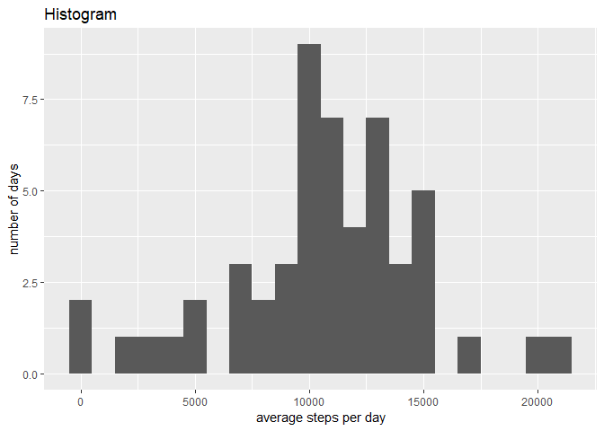
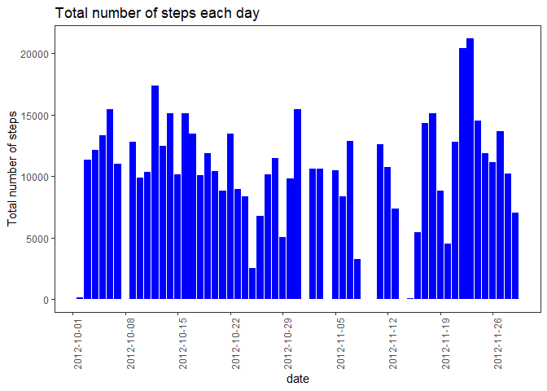
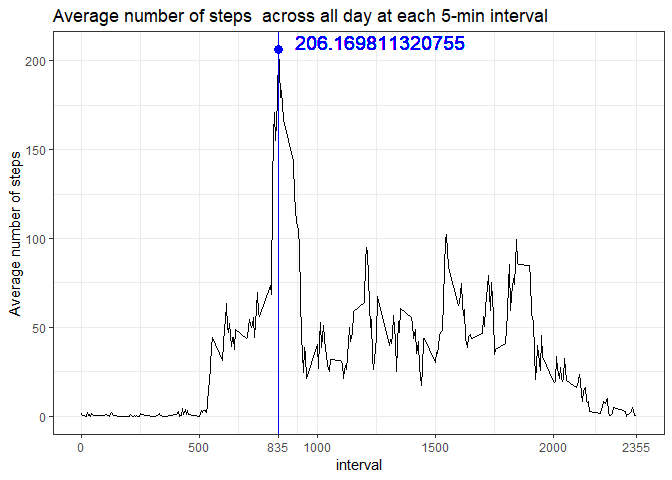
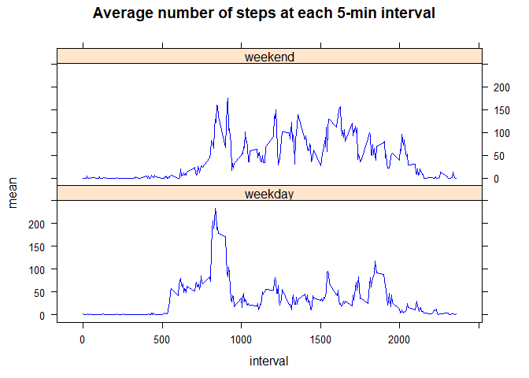

## Loading and preprocessing the data

we can load the data from our zip file using the following code 


```r
data <- read.csv("activity.csv", colClasses = c("numeric", "Date", 
    "integer"))
data = na.omit(data)
```


## What is mean total number of steps taken per day?

we need to  

** know the relative distribution of steps per day taken over the course of the dataset
** then report the Mean and Median values corresponding to this distribution
** Ignore NA and do not count NA as 0.

lets do this using r code 


```r
## we will need plotting library 
library(plyr)
library(ggplot2)
```


```r
steps_day <- tapply(data$steps, data$date, sum)
qplot(steps_day, xlab = "average steps per day", ylab = "number of days", binwidth = 1000, 
    main = "Histogram")
```

<!-- -->

### mean and median


```r
mean(steps_day, na.rm = T)
```

```
## [1] 10766.19
```

and the median will be 


```r
median(steps_day, na.rm = T)
```

```
## [1] 10765
```


the mean is 10766 and the median is 10765

### Make a histogram of the total number of steps taken each day


```r
TstepAday <- ddply(data, .(date), summarize, total = sum(steps))

library("ggplot2")
hist <- ggplot(TstepAday, aes(x = date, y = total)) + geom_histogram(stat = "identity", 
    binwidth = 1, fill = "blue", position = "dodge") + labs(title = "Total number of steps each day", 
    y = "Total number of steps") + scale_x_date(breaks = "1 week") + theme_bw() + 
    theme(panel.grid.minor = element_blank(), panel.grid.major = element_blank()) + 
    theme(axis.text.x = element_text(angle = 90))
print(hist)
```

<!-- -->


## What is the average daily activity pattern?

we take time series plot of the 5 minute intervals and average number of steps per day, averaged across all days.


## Make a data frame with the mean steps over the intervals 


```r
stepsday <- ddply(data, .(interval), summarize, mean = mean(steps, na.rm = TRUE))
```

second, plot time series plot of intervals and mean steps per day


```r
timeplot <- ggplot(stepsday, aes(x = interval, y = mean)) + geom_line() + 
labs(title = "Average number of steps  across all day at each 5-min interval", 
    y = "Average number of steps") + ##### annotate the plot
geom_vline(aes(xintercept = stepsday[which.max(stepsday$mean), 1]), colour = "blue") + 
    scale_x_continuous(breaks = c(0, 500, stepsday[which.max(stepsday$mean), 
        1], 1000, 1500, 2000, max(stepsday$interval))) + annotate("point", x = stepsday[which.max(stepsday$mean), 
    1], y = max(stepsday$mean), size = 3, colour = "blue") + geom_text(x = stepsday[which.max(stepsday$mean), 
    1], y = max(stepsday$mean), size = 5, colour = "blue", label = max(stepsday$mean), 
    vjust = 0, hjust = -0.1) + theme_bw()
print(timeplot)
```

<!-- -->


## Imputing missing values

### cound The total number of missing values in the dataset


```r
imputedata <- data[is.na(data$steps) == T, ]
```

### impute missing data with mean of corresponding 5-min intervals


```r
for (i in imputedata$date) {
    imputedata[imputedata$date == i, ][, 1] <- stepsday[, 2]
}
```

### Create a new dataset with imputed data


```r
data_new  <- rbind(data[is.na(data$steps) == F, ], imputedata)
```

### create Histogram of the total number of steps taken each day using new dataset


```r
stepsday_new <- ddply(data_new, .(date), summarize, total = sum(steps))
hist2 <- ggplot(stepsday_new, aes(x = date, y = total)) + geom_histogram(stat = "identity", 
    binwidth = 1, fill = "blue") + labs(title = "Total number of steps each day", 
    y = "Total number of steps") + scale_x_date(breaks = "1 week") + theme_bw() + 
    theme(panel.grid.minor = element_blank(), panel.grid.major = element_blank()) + 
    theme(axis.text.x = element_text(angle = 90))
print(hist)
```

<!-- -->

### Calculate mean and median


```r
mean(stepsday_new$total)
```

```
## [1] 10766.19
```

```r
median(stepsday_new$total)
```

```
## [1] 10765
```

as we can see the median and mean values of imputed data is the same compared to the data with missing values. 

## Are there differences in activity patterns between weekdays and weekends?


### lets create a variable indicating whether a given date is a weekday or weekend day


```r
library("chron")
```

```
## NOTE: The default cutoff when expanding a 2-digit year
## to a 4-digit year will change from 30 to 69 by Aug 2020
## (as for Date and POSIXct in base R.)
```

```r
data_new$weekday[is.weekend(data_new$date) == F] <- "weekday"
data_new$weekday[is.weekend(data_new$date) == T] <- "weekend"
```

### now create time series plot 


```r
series <- ddply(data_new, .(interval, weekday), summarize, mean = mean(steps))
```


```r
library("lattice")
series <- transform(series, weekday = factor(weekday))
timeplot2 <- xyplot(mean ~ interval | weekday, data = series, layout = c(1, 
    2), main = "Average number of steps at each 5-min interval", panel = function(x, 
    y, ...) {
    panel.lines(x, y, col = "blue")
})
print(timeplot2)
```

<!-- -->

There  is a difference in the pattern between weekdays and weekends, people wake up earlier in the weekdays than weekends. 
